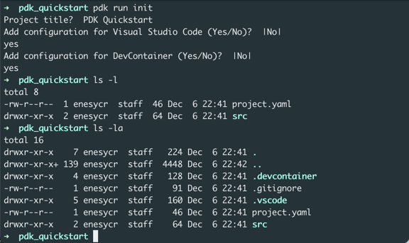
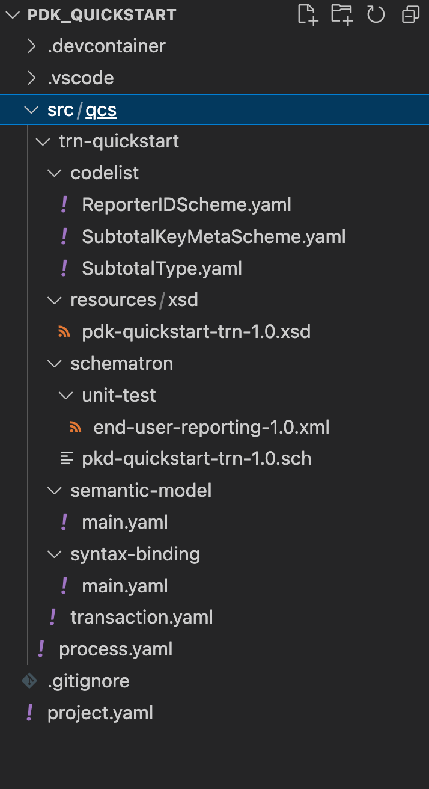
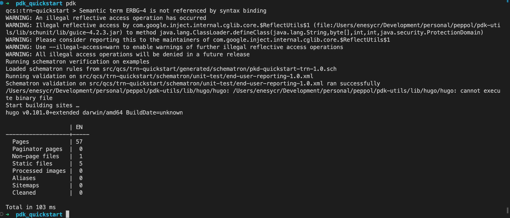
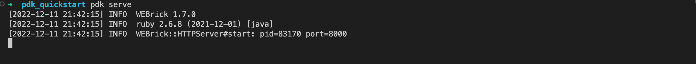
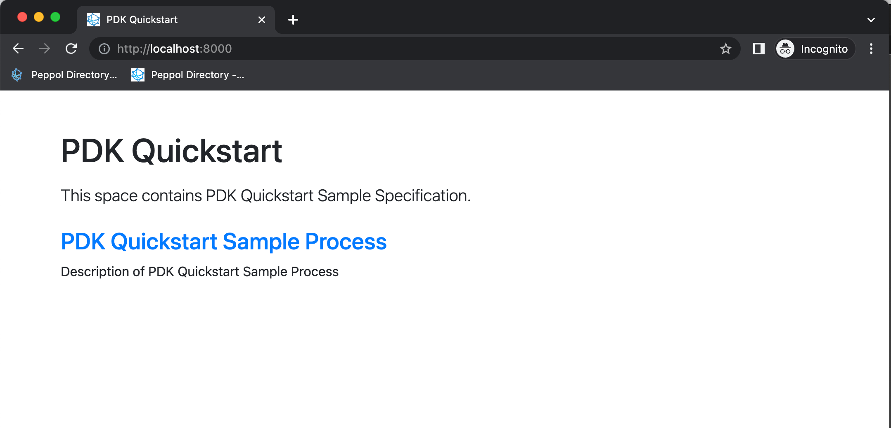
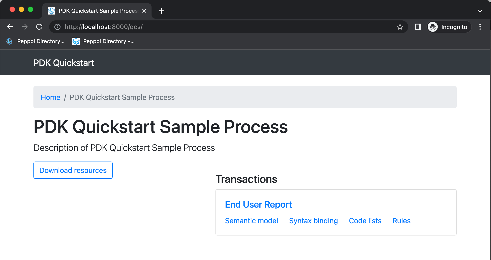

= PDK Quickstart Guide

This section provides information on how to create a Peppol BIS documentation project from scratch with the PDK.
At the end, we will create sample static web page which will be the artifact for our Peppol BIS documentation.
We will use the following transaction as a sample in this guide.

.Sample XML (https://docs.peppol.eu/edelivery/specs/reporting/eusr/bis/#appendix-1[OpenPeppol EUSR Bis])
[source,xml,indent=0]
----
include::{quickstart_trn_file}[]
----

== Create Project

[IMPORTANT]
By default, we assumed a unix based system and used `docker-pdk.sh` which can be found https://github.com/OpenPEPPOL/pdk-template/blob/main/docker-pdk.sh[here]. If you are a WINDOWS user, please use the https://github.com/OpenPEPPOL/pdk-template/blob/main/docker-pdk.cmd[Windows CMD alternative].

In order to start a new PDK project, create a folder with the name of your desire and then execute the following command from your favorite terminal:

.Start New Project
[source,bash]
----
docker-pdk.sh run init
----

You can add vscode and devcontainer configuration later with running following commands.

.Configure devcontainer
[source,bash,indent=0]
----
docker-pdk.sh config:devcontainer
----

.Configure VSCode
[source,bash,indent=0]
----
docker-pdk.sh config:vscode
----

== Configurate _project.yaml_

Define the project title, description with the supported languages.

.project.yaml
[source,yaml,indent=0]
----
include::{project_file}[]
----

== Creating Process

Create a folder with a custom name "qcs" under the src; then create `process.yaml` and configure its title, description, version, status.
You can enable the `asciidoctor-pdf` feature if you additionally want a pdf artifact.

.process.yaml
[source,yaml,indent=0]
----
include::{process_file}[]
----

=== Creating Transaction

Create a folder named trn-quickstart under the "qcs"; then create `transaction.yaml` and configurate transaction variable.

.transaction.yaml
[source,yaml,indent=0]
----
include::{transaction_file}[]
----

==== Import XSD

Create a folder named "resources" under the "trn-quickstart" folder, create a file named "pkd-quickstart-trn-1.0" and copy the following source into the file.
Please ensure that path of the XSD file is correct in the `transaction.yaml`.

[source,xml,indent=0]
----
include::{quickstart_trn_xsd_file}[]
----

==== Import Schematron

Create a folder named "schematron" under the "trn-quickstart" folder, create a file named "pkd-quickstart-trn-1.0" and copy the following source into the file.
Ensure that path of the Schematron file is correct in the `transaction.yaml`.

[source,xml,indent=0]
----
include::{quickstart_trn_sch_file}[]
----

In order to run unit tests, create a folder named "unit-test" under the "schematron" folder.
Copy the link:#_pdk_quickstart_guide[transaction] file into that folder.
You can also run unit tests adding the link:#_pdk_quickstart_guide[transaction] file under the "example" folder.

==== Import Code Lists

Create a folder named "codelist" under the "trn-quickstart" folder and copy all the code list files into the "codelist" folder.
Please ensure that all the code lists used in the current transaction are imported. Following code lists are used in the transaction.

* link:sample-source/quickstart/codelist/ReporterIDScheme.yaml[Reporter ID Scheme] (ReporterIDScheme.yaml)
* link:sample-source/quickstart/codelist/SubtotalKeyMetaScheme.yaml[Subtotal Key Meta Scheme] (SubtotalKeyMetaScheme.yaml)
* link:sample-source/quickstart/codelist/SubtotalType.yaml[Subtotal Type] (SubtotalType.yaml)

==== Create Semantic Model
Create a folder named "semantic-model" under the "trn-quickstart" folder.
Create a file named "main.yaml" and copy-paste the following source onto the file.
That file contains all the necessary properties of business term/group of the transaction.

[source,yaml]
----
include::{quickstart_semantic_mode_file}[]
----

==== Create Syntax Binding
Create a folder named "syntax-binding" under the "trn-quickstart" folder.
Create a file named "main.yaml" and copy-paste the following source onto the file.
That file contains all necessary properties of the element in the transaction,
it is also referenced to related business term.

:nocopyblocks:
[source,yaml]
----
include::{quickstart_syntax_binding_file}[]
----

== Quickstart Project Layout

The project folder layout should look like the below given figure.

== Build & Serve

Ensure all the link:#_installation[installation] steps are applied, and open terminal run the `docker-pdk.sh` command, the output should be a below.

Now we can serve our static webpage, running the `docker-pdk.sh serve` command.

Open xref:http://localhost:8000/[http://localhost:8000/], the BIS Document webpage look like below:

We can reach all specification of the process following

